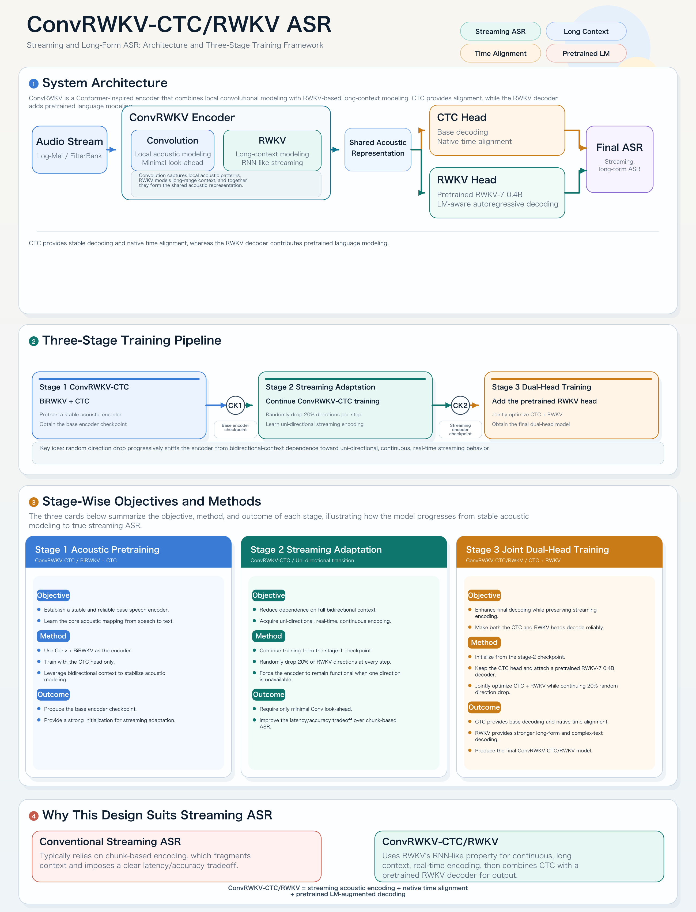
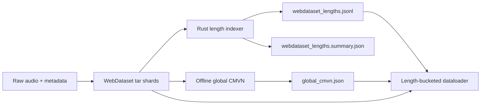
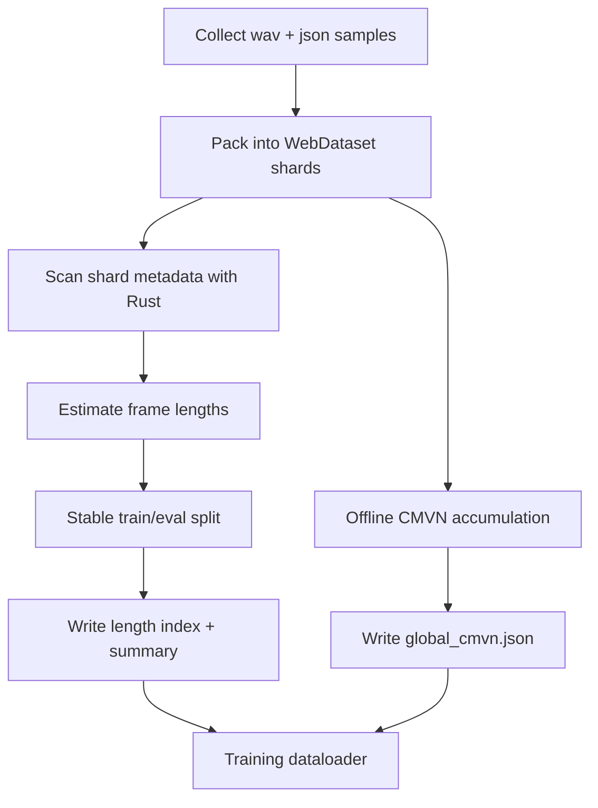
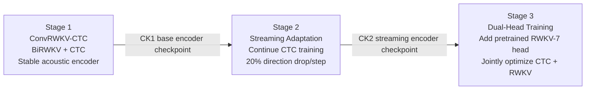
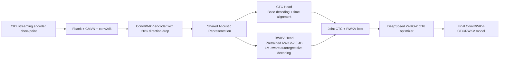
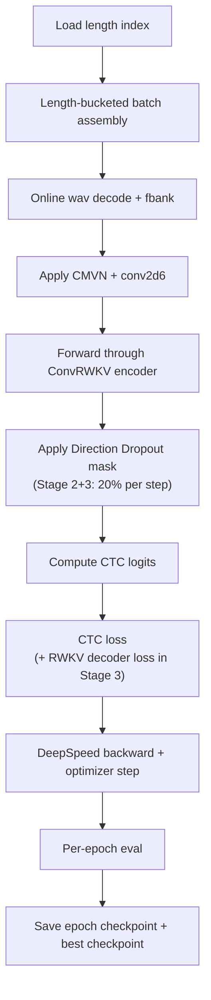
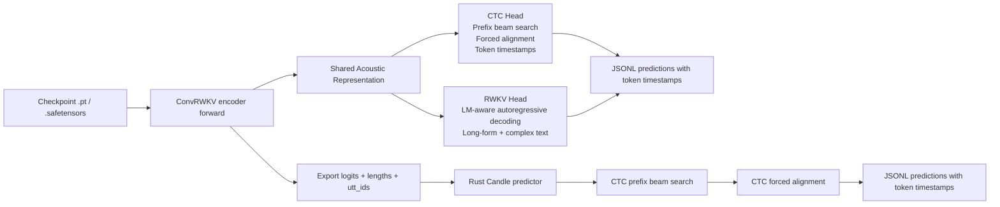
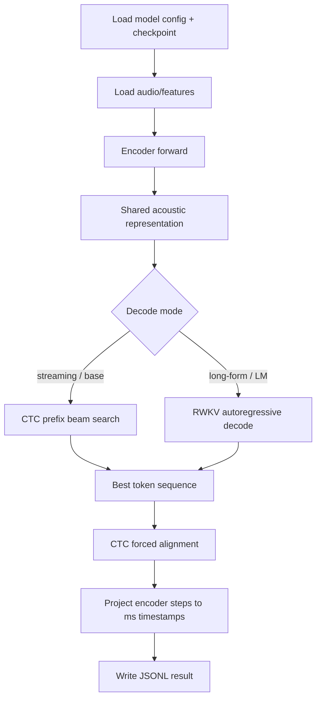

# Architecture

# ConvRWKV-CTC/RWKV ASR

Streaming and Long-Form ASR: Architecture and Three-Stage Training Framework.

ConvRWKV combines local convolutional acoustic modeling with RWKV-based long-context modeling. A `CTC` head provides fast base decoding and native time alignment, while a pretrained `RWKV-7` decoder head adds LM-aware autoregressive decoding for long-form and complex-text scenarios.

## 1. Project Goal

This project targets a practical ASR stack with these capabilities:

| Capability | Description |
|---|---|
| **Streaming ASR** | Real-time, continuous encoding via RWKV's RNN-like recurrent property |
| **Long Context** | RWKV models long-range context without chunking or context fragmentation |
| **Time Alignment** | Native token-level timestamp output from the CTC head |
| **Pretrained LM** | RWKV-7 0.4B decoder head for LM-aware, long-form autoregressive decoding |

Core design constraints:

- encoder: `ConvRWKV` — Conformer-inspired, combining a local convolutional module with `RWKV-7 TimeMixer` for long-context modeling
- decoder heads from the same encoder checkpoint:
  - `CTC Head`: base decoding + native time alignment
  - `RWKV Head`: pretrained RWKV-7 0.4B, LM-aware autoregressive decoding
- train through a **three-stage pipeline** that progresses from stable bidirectional pretraining to true streaming capability and finally dual-head joint training
- support `4 x RTX 4090 + DeepSpeed + bf16` training

## 2. Core Design

### Model

- encoder frontend: `global CMVN + WeNet-style conv2d6`
- encoder body: `ConvRWKV`
  - **Convolution** module: local acoustic modeling, minimal look-ahead
  - **RWKV** (`TimeMixer`): long-context modeling, RNN-like streaming; replaces self-attention only
  - FFN stays standard
- decoder heads (shared acoustic representation):
  - **CTC Head**: base decoding, native time alignment
  - **RWKV Head**: pretrained RWKV-7 0.4B, LM-aware autoregressive decoding
- inference modes from the same checkpoint:
  - **Streaming**: uni-directional RWKV encoding, low-latency continuous output
  - **Long-form**: full bidirectional context + RWKV LM decoder for highest accuracy

### Three-Stage Training Pipeline

Training progresses through three stages, each building on the previous checkpoint:

```
Stage 1                    Stage 2                       Stage 3
ConvRWKV-CTC          ─CK1─▶  Streaming Adaptation  ─CK2─▶  Dual-Head Training
BiRWKV + CTC                  Continue CTC training         Add pretrained RWKV head
Stable acoustic encoder       20% direction drop/step       Jointly optimize CTC + RWKV
Base encoder checkpoint       Streaming encoder ckpt        Final dual-head model
```

**Stage 1 — Acoustic Pretraining** (`ConvRWKV-CTC / BiRWKV + CTC`)
- *Objective*: establish a stable, reliable base speech encoder; learn the core acoustic mapping from speech to text
- *Method*: use Conv + BiRWKV as the encoder; train with CTC head only; leverage bidirectional context to stabilize acoustic modeling
- *Outcome*: base encoder checkpoint; strong initialization for streaming adaptation

**Stage 2 — Streaming Adaptation** (`ConvRWKV-CTC / Uni-directional transition`)
- *Objective*: reduce dependence on full bidirectional context; acquire uni-directional, real-time, continuous encoding
- *Method*: continue training from stage-1 checkpoint; randomly drop 20% of RWKV directions at every step; force the encoder to function when one direction is unavailable
- *Outcome*: requires only minimal Conv look-ahead; improves the latency/accuracy tradeoff over chunk-based ASR

**Stage 3 — Joint Dual-Head Training** (`ConvRWKV-CTC/RWKV / CTC + RWKV`)
- *Objective*: enhance final decoding while preserving streaming encoding; make both heads decode reliably
- *Method*: initialize from stage-2 checkpoint; keep CTC head and attach pretrained RWKV-7 0.4B decoder; jointly optimize CTC + RWKV while continuing 20% direction drop
- *Outcome*: CTC provides base decoding and native time alignment; RWKV provides stronger long-form and complex-text decoding; produces the final ConvRWKV-CTC/RWKV model

### Prediction

- Python:
  - full-model prediction from `.pt` or `.safetensors`
  - `CTC prefix beam search`
  - token-level `CTC forced alignment`
- Rust + Candle:
  - current scope is decode-stage inference
  - consumes exported `logits + lengths + utt_ids`
  - runs `CTC prefix beam search`
  - outputs token-level time alignment

## 3. Data Preparation

### 3.1 Data Preparation Architecture



### 3.2 Data Preparation Flow



## 4. Training

### 4.1 Three-Stage Training Overview



### 4.2 Stage 1 — Acoustic Pretraining


### 4.3 Stage 2 — Streaming Adaptation


### 4.4 Stage 3 — Joint Dual-Head Training



### 4.5 Training Flow



## 5. Prediction

### 5.1 Prediction Architecture



### 5.2 Prediction Flow



## 6. Why This Design Suits Streaming ASR

| | Conventional Streaming ASR | ConvRWKV-CTC/RWKV |
|---|---|---|
| **Encoding** | Chunk-based, fragments context | RWKV's RNN-like recurrence: continuous, long-context, real-time |
| **Latency** | Clear latency/accuracy tradeoff due to chunking | Minimal Conv look-ahead only; no chunk boundary artifacts |
| **Output** | Typically text only | CTC native time alignment + LM-augmented decoding |
| **LM integration** | External re-scoring | Pretrained RWKV-7 0.4B decoder baked in |

> **ConvRWKV-CTC/RWKV** = streaming acoustic encoding + native time alignment + pretrained LM-augmented decoding

## 7. Implementation Status

### Completed

- `uv` project and training environment definition
- `RWKV-7 TimeMixer` PyTorch implementation
- bidirectional RWKV wrapper (`ConvRWKV` encoder)
- `Direction Dropout` (Stage 2+3: 20% per step)
- Conformer-style ConvRWKV encoder block
- `CTC` head and loss path (Stage 1–3)
- WeNet-style `fbank + CMVN + conv2d6` frontend
- WebDataset online decode loader
- Rust multithreaded WebDataset length indexer
- length-bucketed training batches
- DeepSpeed ZeRO-2 multi-GPU training entrypoint
- per-epoch eval and best-checkpoint selection
- checkpoint export to `.safetensors`
- Python full-model prediction (CTC head)
- Python token-level CTC time alignment
- Rust + Candle decode-stage predictor
- Rust token-level CTC time alignment
- Python export of `logits + lengths + utt_ids` for Rust decode

### In Progress

- Stage 1 → Stage 2 → Stage 3 pipeline execution on target hardware
- Stage 3 RWKV-7 0.4B decoder head integration and joint training
- prediction/export workflow hardening for real eval runs
- streaming vs. long-form decode comparison from the same checkpoint

### Planned

- Rust full-model RWKV forward path
  - likely via Candle custom ops for the RWKV recurrent core
- streaming validation and latency reporting
- CER / WER reporting on held-out eval sets
- hotword biasing via weighted finite-state context graph
- benchmark scripts for throughput and memory

Public roadmap and task breakdown live in [ROADMAP.md](./ROADMAP.md).

## 8. Current Training Summary

This repository does **not** include training artifacts, checkpoints, DeepSpeed states, or data shards. The numbers below document current progress only.

### Dataset

As of `2026-03-23`:

- WebDataset shards: `101`
- total samples: `985,531`
- train samples: `965,531`
- eval samples: `20,000`
- minimum frames: `8`
- maximum frames: `3329`
- split policy: stable hash split by `shard_name`

### Current public training summary

Run: `runs/paper_bi_baseline_4x4090`

| Epoch | Step | Train Loss | Eval Loss |
| --- | ---: | ---: | ---: |
| 1 | 1578 | 6.1032 | 3.8228 |
| 2 | 3156 | 3.0942 | 2.4147 |
| 3 | 4734 | 2.2993 | 1.9029 |
| 4 | 6312 | 1.9542 | 1.6913 |
| 5 | 7890 | 1.7451 | 1.5618 |
| 6 | 9468 | 1.6020 | 1.4483 |
| 7 | 11046 | 1.4964 | 1.4162 |
| 8 | 12624 | 1.4139 | 1.3562 |

Current best:

- best epoch: `8`
- best eval loss: `1.356161480373144`
- corresponding train loss: `1.413856222917177`

These are training-time selection metrics, not final `CER/WER`.

## 9. Repository Layout

```text
src/rwkvasr/
  data/          data pipeline, WebDataset, CMVN, tokenizers
  modules/       RWKV-CTC model, frontend, encoder blocks
  training/      optimizer, loops, checkpointing, DeepSpeed integration
  predict/       Python CTC prefix beam search and alignment
  cli/           train / eval / predict / export CLIs

tools/
  Rust preprocessing and Rust+Candle decode tools

configs/
  training configs for paper-style runs

scripts/
  launch helpers
```

## 10. Quick Start

### Python / training side

```bash
uv sync --extra dev
```

```bash
./scripts/train_paper_rwkv_asr.sh bi_baseline
```

### Export checkpoint weights

```bash
rwkvasr-export-safetensors \
  --checkpoint-path runs/paper_bi_baseline_4x4090/best.pt \
  --output-path runs/paper_bi_baseline_4x4090/best.safetensors \
  --copy-model-config
```

### Python full-model prediction

```bash
rwkvasr-predict-ctc \
  --checkpoint-path runs/paper_bi_baseline_4x4090/best.safetensors \
  --config-yaml runs/paper_bi_baseline_4x4090/model_config.yaml \
  --webdataset-root /path/to/webdataset \
  --webdataset-split eval \
  --device cuda \
  --mode bi \
  --beam-size 8 \
  --output-path runs/paper_bi_baseline_4x4090/preds.eval.jsonl
```

### Export Rust decode inputs

```bash
rwkvasr-export-ctc-logits \
  --checkpoint-path runs/paper_bi_baseline_4x4090/best.safetensors \
  --config-yaml runs/paper_bi_baseline_4x4090/model_config.yaml \
  --webdataset-root /path/to/webdataset \
  --webdataset-split eval \
  --device cuda \
  --mode bi \
  --output-dir runs/paper_bi_baseline_4x4090/rust_decode_inputs
```

### Rust decode-stage prediction

```bash
cargo run --release --manifest-path tools/Cargo.toml --bin predict_ctc -- \
  --tensors-path runs/paper_bi_baseline_4x4090/rust_decode_inputs/part-00000.safetensors \
  --utt-ids-path runs/paper_bi_baseline_4x4090/rust_decode_inputs/part-00000.utt_ids.txt \
  --beam-size 8 \
  --subsampling-rate 6 \
  --right-context 10 \
  --frame-shift-ms 10 \
  --output-path runs/paper_bi_baseline_4x4090/rust_decode_inputs/part-00000.predictions.jsonl
```

## 11. Notes

- This repository intentionally excludes:
  - checkpoints
  - DeepSpeed optimizer states
  - TensorBoard logs
  - training `runs/`
  - exported `.safetensors` artifacts
  - local datasets
- the current Rust predictor is a decode-stage tool, not yet a full RWKV model forward implementation
- project design details and rationale remain in [Spec.md](./Spec.md)
