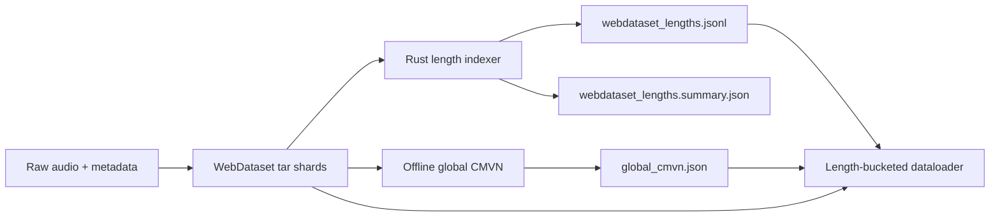
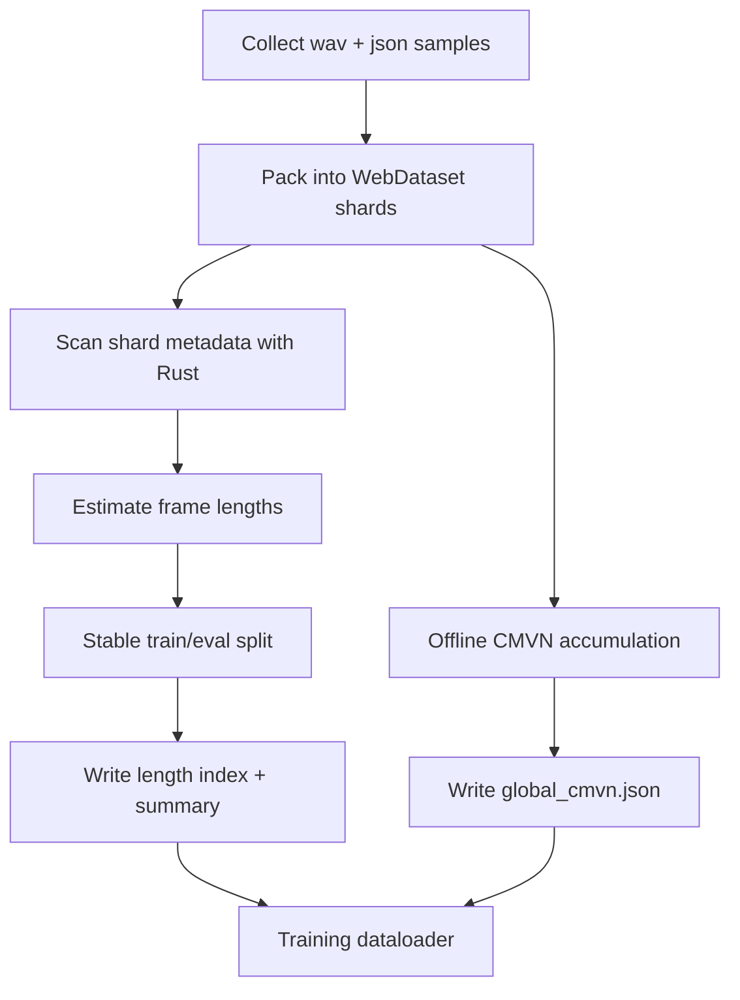
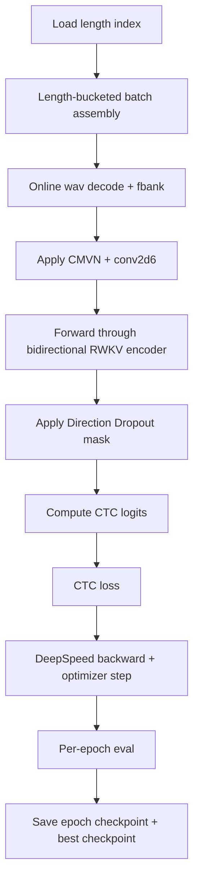
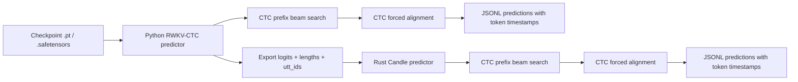
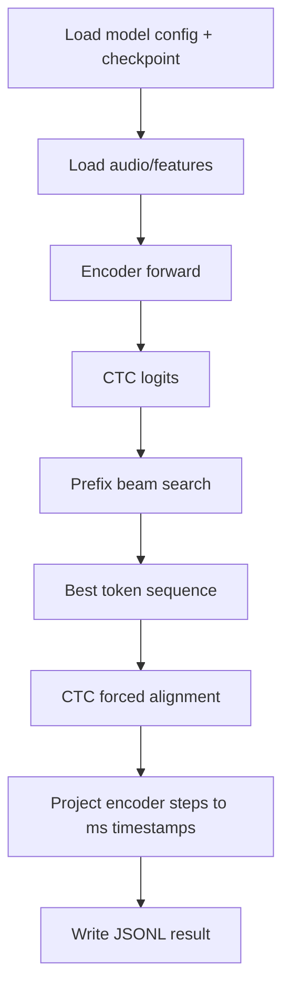

# rwkvasr_longform_asr

Long-form ASR with `RWKV-7 TimeMixer`, `bidirectional RWKV + Direction Dropout`, and a `CTC` head for one-checkpoint dual-mode speech recognition.

## 1. Project Goal

This project targets a practical ASR stack with these constraints:

- replace encoder self-attention with `RWKV-7 TimeMixer`
- keep the non-attention path Conformer-like
  - FFN / MLP remains standard
  - convolution module remains available
- train a single checkpoint that supports both:
  - offline bidirectional ASR
  - streaming left-to-right ASR
- use `CTC` as the main recognition head for efficiency, alignment, and on-device deployment
- support `4 x RTX 4090 + DeepSpeed + bf16` training

The main paper-reproduction direction is:

- `bidirectional RWKV encoder`
- `Direction Dropout`
- `fixed 20% DirDrop` for the strict paper-style setup

## 2. Core Design

### Model

- encoder frontend: `global CMVN + WeNet-style conv2d6`
- encoder body: `Conformer-style RWKV`
  - `TimeMixer` replaces self-attention only
  - FFN stays standard
  - conv module stays available
- head: `CTC`
- inference modes from the same checkpoint:
  - `Bi`
  - `L2R`
  - `R2L`
  - `Alt`

### Training

- bf16 end-to-end on CUDA, fp32 only in numerically sensitive paths
- DeepSpeed ZeRO-2
- WebDataset audio shards
- offline length indexing for stable bucketed batching
- optional Rust tools for preprocessing and decode-stage deployment validation

### Prediction

- Python:
  - full-model prediction from `.pt` or `.safetensors`
  - `CTC prefix beam search`
  - token-level `CTC forced alignment`
- Rust + Candle:
  - current scope is decode-stage inference
  - consumes exported `logits + lengths + utt_ids`
  - runs `CTC prefix beam search`
  - outputs token-level time alignment

## 3. Data Preparation

### 3.1 Data Preparation Architecture



### 3.2 Data Preparation Flow



## 4. Training

### 4.1 Training Architecture


### 4.2 Training Flow



## 5. Prediction

### 5.1 Prediction Architecture



### 5.2 Prediction Flow



## 6. Implementation Status

### Completed

- `uv` project and training environment definition
- `RWKV-7 TimeMixer` PyTorch implementation
- bidirectional RWKV wrapper
- `Direction Dropout`
- Conformer-style RWKV encoder block
- `CTC` model and loss path
- WeNet-style `fbank + CMVN + conv2d6` frontend
- WebDataset online decode loader
- Rust multithreaded WebDataset length indexer
- length-bucketed training batches
- DeepSpeed ZeRO-2 multi-GPU training entrypoint
- per-epoch eval and best-checkpoint selection
- checkpoint export to `.safetensors`
- Python full-model prediction
- Python token-level CTC time alignment
- Rust + Candle decode-stage predictor
- Rust token-level CTC time alignment
- Python export of `logits + lengths + utt_ids` for Rust decode

### In Progress

- longer training runs and checkpoint selection under paper-style configs
- prediction/export workflow hardening for real eval runs
- same-checkpoint `Bi / L2R / Alt` decode comparison

### Planned

- Rust full-model RWKV forward path
  - likely via Candle custom ops for the RWKV recurrent core
- streaming validation and latency reporting
- CER / WER reporting on held-out eval sets
- hotword biasing via weighted finite-state context graph
- benchmark scripts for throughput and memory

Public roadmap and task breakdown live in [ROADMAP.md](./ROADMAP.md).

## 7. Current Training Summary

This repository does **not** include training artifacts, checkpoints, DeepSpeed states, or data shards. The numbers below document current progress only.

### Dataset

As of `2026-03-23`:

- WebDataset shards: `101`
- total samples: `985,531`
- train samples: `965,531`
- eval samples: `20,000`
- minimum frames: `8`
- maximum frames: `3329`
- split policy: stable hash split by `shard_name`

### Current public training summary

Run: `runs/paper_bi_baseline_4x4090`

| Epoch | Step | Train Loss | Eval Loss |
| --- | ---: | ---: | ---: |
| 1 | 1578 | 6.1032 | 3.8228 |
| 2 | 3156 | 3.0942 | 2.4147 |
| 3 | 4734 | 2.2993 | 1.9029 |
| 4 | 6312 | 1.9542 | 1.6913 |
| 5 | 7890 | 1.7451 | 1.5618 |
| 6 | 9468 | 1.6020 | 1.4483 |
| 7 | 11046 | 1.4964 | 1.4162 |
| 8 | 12624 | 1.4139 | 1.3562 |

Current best:

- best epoch: `8`
- best eval loss: `1.356161480373144`
- corresponding train loss: `1.413856222917177`

These are training-time selection metrics, not final `CER/WER`.

## 8. Repository Layout

```text
src/rwkvasr/
  data/          data pipeline, WebDataset, CMVN, tokenizers
  modules/       RWKV-CTC model, frontend, encoder blocks
  training/      optimizer, loops, checkpointing, DeepSpeed integration
  predict/       Python CTC prefix beam search and alignment
  cli/           train / eval / predict / export CLIs

tools/
  Rust preprocessing and Rust+Candle decode tools

configs/
  training configs for paper-style runs

scripts/
  launch helpers
```

## 9. Quick Start

### Python / training side

```bash
uv sync --extra dev
```

```bash
./scripts/train_paper_rwkv_asr.sh bi_baseline
```

### Export checkpoint weights

```bash
rwkvasr-export-safetensors \
  --checkpoint-path runs/paper_bi_baseline_4x4090/best.pt \
  --output-path runs/paper_bi_baseline_4x4090/best.safetensors \
  --copy-model-config
```

### Python full-model prediction

```bash
rwkvasr-predict-ctc \
  --checkpoint-path runs/paper_bi_baseline_4x4090/best.safetensors \
  --config-yaml runs/paper_bi_baseline_4x4090/model_config.yaml \
  --webdataset-root /path/to/webdataset \
  --webdataset-split eval \
  --device cuda \
  --mode bi \
  --beam-size 8 \
  --output-path runs/paper_bi_baseline_4x4090/preds.eval.jsonl
```

### Export Rust decode inputs

```bash
rwkvasr-export-ctc-logits \
  --checkpoint-path runs/paper_bi_baseline_4x4090/best.safetensors \
  --config-yaml runs/paper_bi_baseline_4x4090/model_config.yaml \
  --webdataset-root /path/to/webdataset \
  --webdataset-split eval \
  --device cuda \
  --mode bi \
  --output-dir runs/paper_bi_baseline_4x4090/rust_decode_inputs
```

### Rust decode-stage prediction

```bash
cargo run --release --manifest-path tools/Cargo.toml --bin predict_ctc -- \
  --tensors-path runs/paper_bi_baseline_4x4090/rust_decode_inputs/part-00000.safetensors \
  --utt-ids-path runs/paper_bi_baseline_4x4090/rust_decode_inputs/part-00000.utt_ids.txt \
  --beam-size 8 \
  --subsampling-rate 6 \
  --right-context 10 \
  --frame-shift-ms 10 \
  --output-path runs/paper_bi_baseline_4x4090/rust_decode_inputs/part-00000.predictions.jsonl
```

## 10. Notes

- This repository intentionally excludes:
  - checkpoints
  - DeepSpeed optimizer states
  - TensorBoard logs
  - training `runs/`
  - exported `.safetensors` artifacts
  - local datasets
- the current Rust predictor is a decode-stage tool, not yet a full RWKV model forward implementation
- project design details and rationale remain in [Spec.md](./Spec.md)
