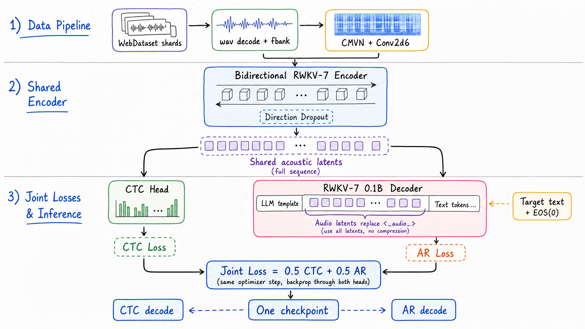
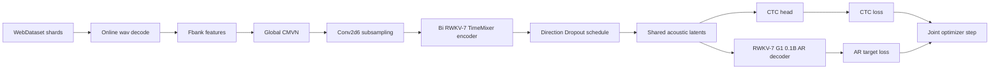
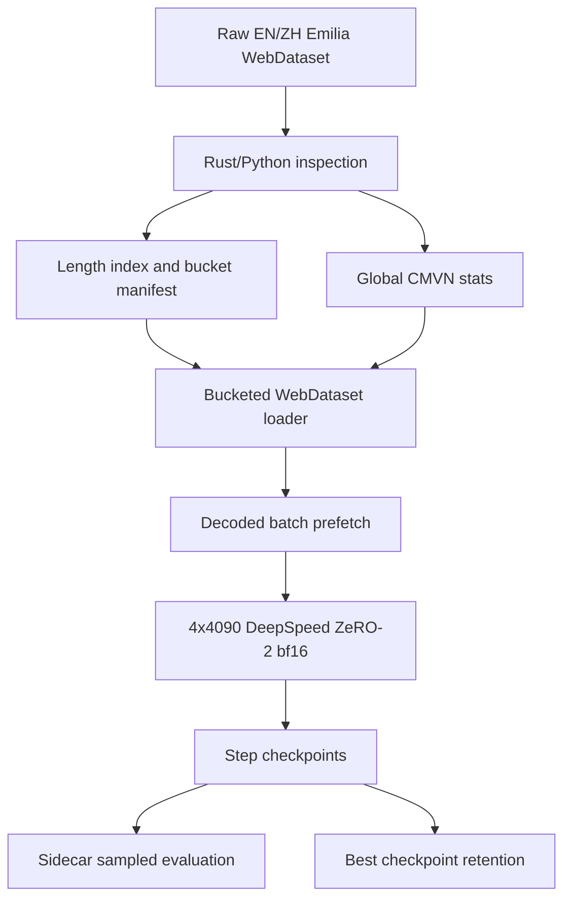
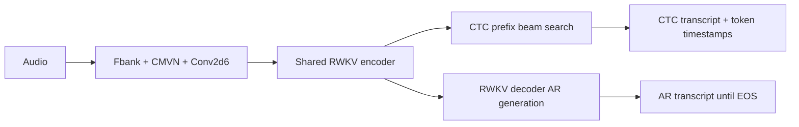

# RWKVASR Long-Form ASR

RWKVASR is an experimental long-form ASR system built around a shared RWKV-7 acoustic encoder and two decoding objectives:

- `CTC` remains the efficient real-time path, with prefix beam search and timestamp alignment.
- `RWKV-7 AR decoder` is trained jointly from the same encoder latents to improve language consistency and provide a second decoding mode.
- `Bidirectional RWKV + Direction Dropout` remains the main encoder design so one checkpoint can support non-streaming and streaming-style inference.

The current training target is not "CTC first, decoder later". The mainline is one-step joint training:

```text
loss = 0.5 * CTC loss + 0.5 * RWKV decoder AR loss
```

## Current Architecture



The decoder is conditioned like a small language model with an audio placeholder:

```text
User: Transcribe the audio to text in its own language.
<_audio_>
Assistant: TARGET TEXT
EOS(0)
```

During training, the encoder output for the full audio sequence replaces `<_audio_>`. No pooling or prefix compression is used. The AR loss masks prompt and audio positions with `-100`, and supervises only `TARGET TEXT + EOS(0)`. The CTC loss is computed from the same encoder sequence.



## Model Design

The encoder keeps the Conformer-like non-attention structure: RWKV-7 `TimeMixer` replaces self-attention, while feed-forward / MLP and convolution paths remain standard ASR components. The default frontend is `conv2d6 + CMVN`, matching the WeNet-style acoustic feature path used in this project.

Direction Dropout is implemented as part of the encoder training path. Training starts from full bidirectional RWKV behavior and then drops one direction with a configurable schedule, so the same weights can be evaluated in bidirectional, left-to-right, right-to-left, or alternating modes.

The RWKV decoder path uses the RWKV tokenizer and EOS convention required by RWKV-7 G1. For the current joint configuration, `EOS = 0`, `vocab_size = 65536`, and `blank_id = 65536` for CTC.

## Data And Training Flow



Training is optimized for `4 x RTX 4090`, `DeepSpeed ZeRO-2`, `bf16`, and CUDA fused RWKV kernels. Large Emilia indexes are split into length buckets so each rank sees similar acoustic lengths and avoids excessive padding. Decoded batch prefetch is used to keep the GPU path fed after online wav to fbank decoding.

Main entrypoint:

```bash
./scripts/train_paper_rwkv_asr.sh emilia_en_zh_joint_rwkv7g1
```

Current joint config:

```bash
configs/emilia_en_zh_joint_rwkv7g1_ctc_ar_4x4090_deepspeed.yaml
```

## Prediction Flow



The AR decoder is not used as CTC n-best rescoring in the current design. It receives all encoder latents as the audio segment in the LLM-style template and generates text autoregressively until EOS. CTC remains the primary timestamp-capable path.

Sidecar evaluation can monitor newly written checkpoints:

```bash
./scripts/watch_joint_training_sidecar.sh
```

## Current Training Snapshot

Do not commit or publish checkpoints, run logs, W&B caches, or decoded outputs. The following numbers are only a dated project note from local runs.

Current joint run observed on `2026-05-08`:

```text
run_dir: runs/emilia_en_zh_joint_rwkv7g1_ctc_ar_fullaudio_template_eos0_4x4090_20260504_094402_safe
training: epoch 1, about 64k / 701k steps observed
recent train loss: about 0.92
sampled eval best observed:
  step-58000 eval_loss = 1.7894
  step-56000 eval_loss = 1.8100
  step-63000 eval_loss = 1.8401
```

Latest sampled sidecar comparison still shows CTC ahead of AR on short previews. AR EOS behavior is stable, but AR transcript quality needs more training before it can be treated as a reliable ASR decoder. The expected milestone is at least one full Emilia EN/ZH epoch before judging AR alignment.

Earlier CTC-only Emilia and VoxBox experiments confirmed the prototype can train and decode, but also showed that small or short-utterance-heavy data is insufficient for robust long-form ASR quality.

## Implemented

- RWKV-7 TimeMixer encoder blocks with bidirectional and direction-drop modes.
- CTC model, CTC prefix beam search, and token timestamp alignment.
- WeNet-style fbank, CMVN, and `conv2d6` frontend.
- WebDataset loading, length indexing, shard split, and bucketed sampling.
- Rust-assisted preprocessing tools for large shard indexes.
- DeepSpeed ZeRO-2 bf16 training with step checkpoints and sampled eval.
- RWKV-7 G1 decoder initialization and joint CTC + AR loss path.
- Sidecar checkpoint evaluation for CTC and RWKV decoder predictions.
- Hotword-biased CTC decoding experiments.
- Whisper, Qwen, SentencePiece, and RWKV tokenizer experiments.

## In Progress

- Full-epoch Emilia EN/ZH joint CTC-AR training.
- Better AR generation diagnostics after the decoder has seen enough paired audio/text.
- Stable benchmark reports for CER/WER on AISHELL and short English public audio.
- Rust inference parity for the full model, including custom RWKV fused behavior.
- Streaming validation for the Direction Dropout checkpoint.

## Repository Layout

```text
configs/                 Training configs
scripts/                 Launch and monitoring scripts
src/rwkvasr/data/        WebDataset, manifests, bucketing, features
src/rwkvasr/modules/     Frontend, encoder, CTC model, RWKV decoder
src/rwkvasr/predict/     CTC and AR prediction helpers
src/rwkvasr/training/    Training loops and batch budgeting
tools/                   Rust and utility preprocessing code
tests/                   Unit and smoke tests
assets/diagrams/         Documentation diagrams
assets/hotwords/         Hotword experiment inputs
assets/tokenizers/       Small tokenizer assets when publishable
```

## Verification Targets

Before treating a training change as stable, run the relevant subset:

```bash
uv run pytest
./scripts/train_paper_rwkv_asr.sh emilia_en_zh_joint_rwkv7g1 --dry-run
```

For large training runs, use sampled step evaluation first and reserve full eval for later checkpoints.
