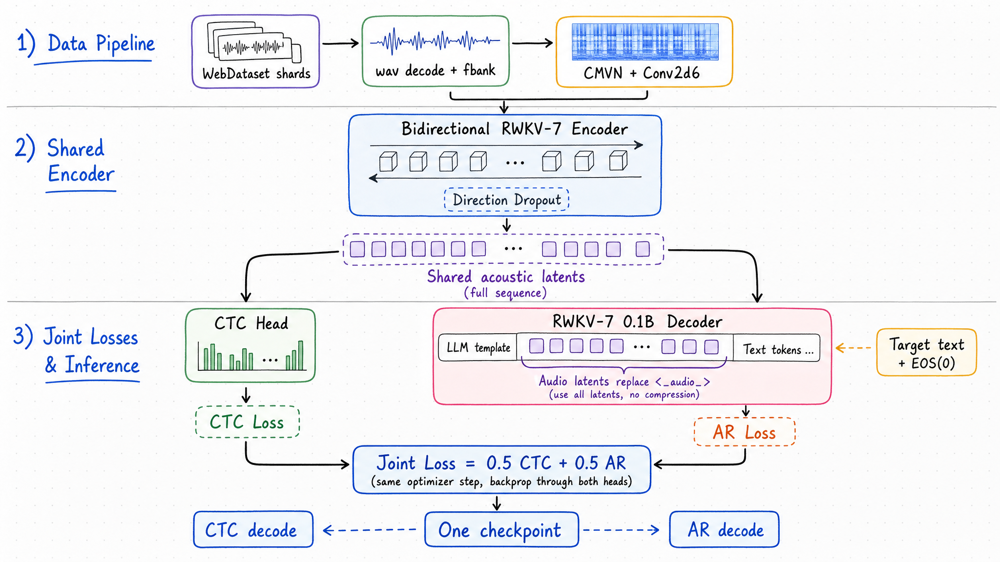
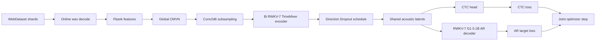
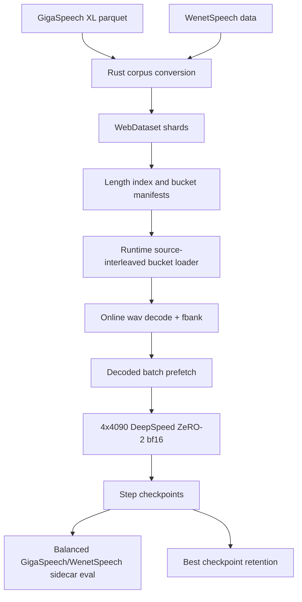
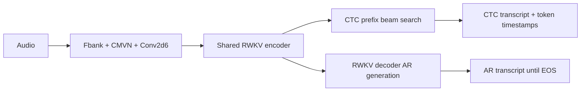

# RWKVASR Long-Form ASR

RWKVASR is an experimental long-form ASR system built around a shared RWKV-7 acoustic encoder and two decoding objectives:

- `CTC` remains the efficient real-time path, with prefix beam search and timestamp alignment.
- `RWKV-7 AR decoder` is trained jointly from the same encoder latents to improve language consistency and provide a second decoding mode.
- `Bidirectional RWKV + Direction Dropout` remains the main encoder design so one checkpoint can support non-streaming and streaming-style inference.

The current training target is not "CTC first, decoder later". The mainline is one-step joint training:

```text
loss = 0.5 * CTC loss + 0.5 * RWKV decoder AR loss
```

## Current Architecture



The decoder is conditioned like a small language model with an audio placeholder:

```text
User: Transcribe the audio to text in its own language.
<_audio_>
Assistant: TARGET TEXT
EOS(0)
```

During training, the encoder output for the full audio sequence replaces `<_audio_>`. No pooling or prefix compression is used. The AR loss masks prompt and audio positions with `-100`, and supervises only `TARGET TEXT + EOS(0)`. The CTC loss is computed from the same encoder sequence.


```mermaid
flowchart LR
    A[WebDataset shards] --> B[Online wav decode]
    B --> C[Fbank features]
    C --> D[Global CMVN]
    D --> E[Conv2d6 subsampling]
    E --> F[Bi RWKV-7 TimeMixer encoder]
    F --> G[Direction Dropout schedule]
    G --> H[Shared acoustic latents]
    H --> I[CTC head]
    H --> J[RWKV-7 G1 0.1B AR decoder]
    I --> K[CTC loss]
    J --> L[AR target loss]
    K --> M[Joint optimizer step]
    L --> M
```

## Model Design

The encoder keeps the Conformer-like non-attention structure: RWKV-7 `TimeMixer` replaces self-attention, while feed-forward / MLP and convolution paths remain standard ASR components. The default frontend is `conv2d6 + CMVN`, matching the WeNet-style acoustic feature path used in this project.

Direction Dropout is implemented as part of the encoder training path. Training starts from full bidirectional RWKV behavior and then drops one direction with a configurable schedule, so the same weights can be evaluated in bidirectional, left-to-right, right-to-left, or alternating modes.

The RWKV decoder path uses the RWKV tokenizer and EOS convention required by RWKV-7 G1. For the current joint configuration, `EOS = 0`, `vocab_size = 65536`, and `blank_id = 65536` for CTC.

## Data And Training Flow


```mermaid
flowchart TD
    A1[GigaSpeech XL parquet] --> B[Rust corpus conversion]
    A2[WenetSpeech data] --> B
    B --> C[WebDataset shards]
    C --> D[Length index and bucket manifests]
    D --> E[Runtime source-interleaved bucket loader]
    E --> F[Online wav decode + fbank]
    F --> G[Decoded batch prefetch]
    G --> H[4x4090 DeepSpeed ZeRO-2 bf16]
    H --> I[Step checkpoints]
    I --> J[Balanced GigaSpeech/WenetSpeech sidecar eval]
    I --> K[Best checkpoint retention]
```

Training is optimized for `4 x RTX 4090`, `DeepSpeed ZeRO-2`, `bf16`, and CUDA fused RWKV kernels. Large indexes are converted and inspected with Rust tools, then loaded with bucketed WebDataset sampling so each rank sees reasonably similar `audio + text` budgets and avoids excessive padding. Decoded batch prefetch is used to keep the GPU path fed after online wav to fbank decoding.

The current mixed corpus uses `GigaSpeech XL` for English and `WenetSpeech L` for Chinese. The mixed WebDataset is represented by symlinked shards plus local indexes, so raw converted data is not duplicated. Because the original bucket manifest is ordered by dataset prefix, training uses runtime source interleaving: bucket parts are grouped by shard prefix such as `GSXL-*` and `WSL-*`, then alternated during sampling. This avoids the earlier failure mode where the first tens of thousands of steps were effectively all English.

Main entrypoint:

```bash
./scripts/train_paper_rwkv_asr.sh gigaspeech_wenetspeech_joint_rwkv7g1_interleave_from_step28000
```

Current joint config:

```bash
configs/gigaspeech_wenetspeech_joint_rwkv7g1_ctc_ar_interleave_from_step28000_4x4090_deepspeed.yaml
```

Useful data preparation commands:

```bash
OVERWRITE=1 COMPUTE_CMVN=0 ./scripts/prepare_gigaspeech_xl.sh
OVERWRITE=1 COMPUTE_CMVN=0 ./scripts/prepare_wenetspeech_l.sh
./scripts/prepare_gigaspeech_wenetspeech_mix.sh
```

## Prediction Flow


```mermaid
flowchart LR
    A[Audio] --> B[Fbank + CMVN + Conv2d6]
    B --> C[Shared RWKV encoder]
    C --> D[CTC prefix beam search]
    C --> E[RWKV decoder AR generation]
    D --> F[CTC transcript + token timestamps]
    E --> G[AR transcript until EOS]
```

The AR decoder is not used as CTC n-best rescoring in the current design. It receives all encoder latents as the audio segment in the LLM-style template and generates text autoregressively until EOS. CTC remains the primary timestamp-capable path.

Sidecar evaluation can monitor newly written checkpoints:

```bash
./scripts/watch_joint_training_sidecar.sh
```

## Current Training Snapshot

Do not commit or publish checkpoints, run logs, W&B caches, or decoded outputs. The following numbers are only a dated project note from local runs.

Current GigaSpeech XL + WenetSpeech L mixed data snapshot observed on `2026-05-21`:

```text
mixed_root: /media/usbhd/training_data/asr/mix/gigaspeech_xl_wenetspeech_l_webdataset
num_shards: 4,731
num_samples: 22,904,403
train_samples: 22,695,193
eval_samples: 209,210
gigaspeech:
  shards: 1,806
  samples: 8,282,988
  train_samples: 8,188,778
  eval_samples: 94,210
wenetspeech:
  shards: 2,925
  samples: 14,621,415
  train_samples: 14,506,415
  eval_samples: 115,000
length_index_summary:
  min_frames: 26
  max_frames: 9,644
  audio_suffixes: flac, mp3, wav
```

Current joint training snapshot observed on `2026-05-21`:

```text
run_dir: runs/gigaspeech_wenetspeech_joint_rwkv7g1_ctc_ar_source_interleave_from_step28000_4x4090
init_checkpoint: runs/gigaspeech_wenetspeech_joint_rwkv7g1_ctc_ar_drop_markup_text_20260519_231959/step-28000.pt
training: epoch 1, about 34k / 278k steps observed
latest observed train loss: about 1.65
latest observed step eval:
  step-34000 eval_loss = 1.1269
best observed step eval:
  step-29000 eval_loss = 1.0697
  step-31000 eval_loss = 1.0800
  step-16000 eval_loss = 1.0839
```

Latest sampled sidecar comparison observed on `2026-05-21`:

```text
latest_sidecar_checkpoint: step-31000.pt
balanced_preview: 6 GigaSpeech + 6 WenetSpeech utterances
overall:
  ctc_token_error: 0.4104
  rwkv_decoder_ar_token_error: 0.4328
gigaspeech:
  ctc_token_error: 0.4234
  rwkv_decoder_ar_token_error: 0.5541
wenetspeech:
  ctc_token_error: 0.6194
  rwkv_decoder_ar_token_error: 0.6472
ar_eos_emitted_ratio: 1.0000
```

CTC is still the more stable decoding path overall. AR generation now reliably emits EOS and sometimes corrects CTC errors, especially on short English or Chinese phrases, but it still introduces language-model rewrites and hallucinations. Chinese quality has improved after runtime source interleaving, but long Chinese utterances remain the main weakness.

Earlier CTC-only Emilia and VoxBox experiments confirmed the prototype can train and decode, but also showed that small or short-utterance-heavy data is insufficient for robust long-form ASR quality.

## Implemented

- RWKV-7 TimeMixer encoder blocks with bidirectional and direction-drop modes.
- CTC model, CTC prefix beam search, and token timestamp alignment.
- WeNet-style fbank, CMVN, and `conv2d6` frontend.
- WebDataset loading, length indexing, shard split, and bucketed sampling.
- Runtime source-interleaved bucket sampling for mixed corpora without rebuilding large bucket manifests.
- Rust-assisted preprocessing tools for large shard indexes.
- Rust-assisted GigaSpeech parquet and WenetSpeech conversion to WebDataset.
- DeepSpeed ZeRO-2 bf16 training with step checkpoints and sampled eval.
- RWKV-7 G1 decoder initialization and joint CTC + AR loss path.
- Sidecar checkpoint evaluation for CTC and RWKV decoder predictions.
- Hotword-biased CTC decoding experiments.
- Whisper, Qwen, SentencePiece, and RWKV tokenizer experiments.

## In Progress

- Full-epoch GigaSpeech XL + WenetSpeech L joint CTC-AR training.
- Better AR generation diagnostics after the decoder has seen enough paired audio/text.
- Stable benchmark reports for CER/WER on AISHELL and short English public audio.
- Rust inference parity for the full model, including custom RWKV fused behavior.
- Streaming validation for the Direction Dropout checkpoint.

## Repository Layout

```text
configs/                 Training configs
scripts/                 Launch and monitoring scripts
src/rwkvasr/data/        WebDataset, manifests, bucketing, features
src/rwkvasr/modules/     Frontend, encoder, CTC model, RWKV decoder
src/rwkvasr/predict/     CTC and AR prediction helpers
src/rwkvasr/training/    Training loops and batch budgeting
tools/                   Rust and utility preprocessing code
tests/                   Unit and smoke tests
assets/diagrams/         Documentation diagrams
assets/hotwords/         Hotword experiment inputs
assets/tokenizers/       Small tokenizer assets when publishable
```

## Verification Targets

Before treating a training change as stable, run the relevant subset:

```bash
uv run pytest
./scripts/train_paper_rwkv_asr.sh emilia_en_zh_joint_rwkv7g1 --dry-run
```

For large training runs, use sampled step evaluation first and reserve full eval for later checkpoints.
